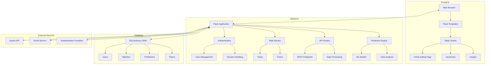

# Sports Analytics Platform

A modern, AI-powered sports analytics platform built with Flask, featuring real-time predictions, beautiful UI, and comprehensive analytics tools.

  


## 🌟 Features

### Core Features
- 🤖 AI-Powered Predictions
  - Match outcome predictions
  - Player performance forecasting
  - Team statistics analysis
  - Historical trend analysis
- 📊 Advanced Data Visualization
  - Interactive charts and graphs
  - Real-time statistics updates
  - Performance comparisons
- 🏆 Multi-Sport Support
  - Football
  - Basketball
  - Baseball
  - Tennis

### User Experience
- 🎨 Modern, Responsive Design
  - Glassmorphism UI elements
  - Smooth animations
  - Mobile-first approach
- 🔐 Secure Authentication
  - Role-based access control
  - Social login integration
  - Password recovery
- 💬 Social Features
  - Community predictions
  - Discussion forums
  - Share analysis

### Technical Features
- ⚡ Real-time Updates
- 📱 Progressive Web App (PWA)
- 🔄 RESTful API
- 📈 Machine Learning Integration

## 📸 Screenshots

### Landing Page

*Modern landing page with glassmorphism design and interactive elements*

### Match Predictions

*AI-powered match prediction interface with detailed statistics*

### Live Matches

*Real-time match tracking with live updates and statistics*

### User Dashboard

*Personalized dashboard showing user predictions and analytics*

### Analytics View

*Comprehensive analytics with interactive charts and insights*

## 🚀 Quick Start

### Prerequisites
- Python 3.11+
- pip
- Virtual environment
- Git

### Installation

1. Clone the repository:
```bash
cd sports_analytics
```

2. Create and activate virtual environment:
```bash
python -m venv venv
venv\Scripts\activate  # Windows
source venv/bin/activate  # Linux/Mac
```

3. Install dependencies:
```bash
pip install -r requirements.txt
```

4. Configure environment:
Create `.env` file with:
```env
FLASK_APP=run.py
FLASK_ENV=development
SECRET_KEY=your-secret-key
DATABASE_URL=sqlite:///sports_analytics.db
MAIL_SERVER=smtp.gmail.com
MAIL_PORT=587
MAIL_USE_TLS=true
MAIL_USERNAME=your-email@gmail.com
MAIL_PASSWORD=your-app-specific-password
SPORTS_API_KEY=your-api-key
```

5. Initialize database:
```bash
flask db init
flask db migrate
flask db upgrade
```

6. Run the application:
```bash
flask run
```

Visit `http://localhost:5000` in your browser.

## 🏗️ Project Structure

```
sports_analytics/
├── app/
│   ├── __init__.py          # App initialization
│   ├── models/              # Database models
│   ├── static/              # Static assets
│   │   ├── css/            # Stylesheets
│   │   ├── js/             # JavaScript files
│   │   └── images/         # Images and icons
│   ├── templates/          # Jinja2 templates
│   ├── auth/              # Authentication
│   ├── main/              # Main routes
│   ├── api/               # API endpoints
│   └── predictions/       # ML predictions
├── migrations/            # Database migrations
├── tests/                # Test suite
├── config.py             # Configuration
├── requirements.txt      # Dependencies
└── run.py               # Application entry
```

## 🏗 Architecture



### Component Description

#### Frontend Layer
- **Web Browser**: Client-side interface
- **Flask Templates**: Jinja2 template engine
- **Static Assets**: CSS, JavaScript, and images

#### Backend Layer
- **Flask Application**: Core application server
- **Authentication**: User management and security
- **Main Routes**: Primary application endpoints
- **API Routes**: RESTful service endpoints
- **Prediction Engine**: ML model integration

#### Database Layer
- **SQLAlchemy ORM**: Database abstraction
- **Data Models**: Users, Matches, Predictions, Teams

#### External Services
- **Sports API**: Real-time sports data
- **Email Service**: User notifications
- **Auth Providers**: Social login integration

## 🔧 Configuration

### Environment Variables
- `FLASK_APP`: Application entry point
- `FLASK_ENV`: Development/production
- `SECRET_KEY`: App security key
- `DATABASE_URL`: Database connection
- `MAIL_*`: Email configuration
- `SPORTS_API_KEY`: External API key

### Database Setup
The application uses SQLAlchemy ORM with support for:
- SQLite (development)
- PostgreSQL (production)
- MySQL (optional)

## 📚 API Documentation

### REST Endpoints

#### Authentication
- `POST /api/v1/auth/login`
- `POST /api/v1/auth/register`
- `POST /api/v1/auth/refresh`

#### Predictions
- `GET /api/v1/predictions`
- `POST /api/v1/predictions`
- `GET /api/v1/predictions/<id>`

#### Matches
- `GET /api/v1/matches`
- `GET /api/v1/matches/<id>`
- `GET /api/v1/matches/live`

#### Teams & Players
- `GET /api/v1/teams`
- `GET /api/v1/players`
- `GET /api/v1/statistics`

## 🤖 Machine Learning Models

### Prediction Models
- Match Outcome Prediction
- Player Performance Forecasting
- Team Statistics Analysis
- Historical Trend Analysis

### Data Processing
- Feature Engineering
- Real-time Data Integration
- Historical Data Analysis

## 🎨 UI/UX Features

### Modern Design Elements
- Glassmorphism cards
- Gradient backgrounds
- Animated transitions
- Responsive layouts
- Interactive elements

### Components
- Hero section
- Feature cards
- Match predictions
- Statistics dashboard
- User profiles

## 🔐 Security

- CSRF Protection
- SQL Injection Prevention
- XSS Protection
- Rate Limiting
- Input Validation

## 📱 Mobile Support

- Responsive Design
- Touch-friendly Interface
- PWA Features
- Offline Capability

## 🤝 Contributing

1. Fork the repository
2. Create your feature branch
3. Commit your changes
4. Push to the branch
5. Create a Pull Request

## 📄 License

This project is licensed under the MIT License - see the LICENSE file for details.

## 🙏 Acknowledgments

- Flask Team
- SQLAlchemy Team
- Sports Data Providers
- Open Source Community


